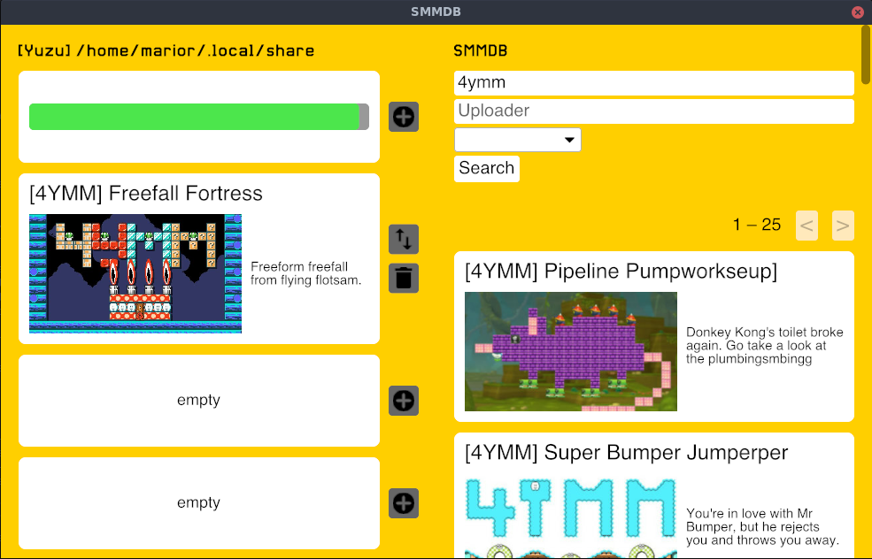

# SMMDB Client

Save file editor for Super Mario Maker 2.

It will automatically detect your Yuzu and Ryujinx save folder, but you can also manually select any SMM2 save file on your system.

This software lets you download courses from [SMMDB](https://smmdb.net).
For planned features, please visit the [Github issue page](https://github.com/Tarnadas/smmdb-client/issues)

## Install

You can download Windows, Linux and MacOS binaries in the [Github release section](https://github.com/Tarnadas/smmdb-client/releases)

### via Cargo

You can install SMMDB Client via Cargo:

`cargo install --git https://github.com/Tarnadas/smmdb-client.git`

It is recommended to install Cargo via [Rustup](https://rustup.rs/)

### via Chocolatey (Windows Only)

`choco install smmdb-client`

Chocolatey install instructions/docs [Chocolatey.org](https://chocolatey.org/install)
